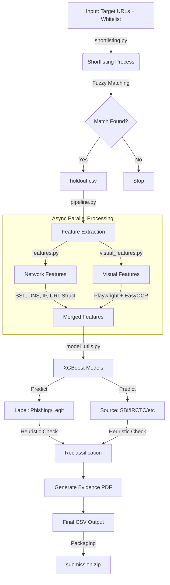

# Phishing Detection Pipeline - Codebase Context

## 1. Project Overview
This project is an automated Phishing Detection Pipeline designed to identify lookalike or "squatted" domains that mimic legitimate critical sector entities (banks, government, etc.). It uses a combination of fuzzy matching, network analysis, visual analysis (screenshots/OCR), and machine learning (XGBoost) to classify domains and generate evidence reports.

## 2. Directory Structure & File Purposes

### Root Directory
| File | Purpose |
| :--- | :--- |
| [main_controller.py](file:///c:/Users/SATWIK/Documents/Phishing/main_controller.py) | **Entry Point.** Orchestrates the entire flow: (1) Shortlisting -> (2) Pipeline -> (3) Packaging. CLI interface. |
| [benchmark.py](file:///c:/Users/SATWIK/Documents/Phishing/benchmark.py) | Performance benchmarking script (likely used for optimizing the pipeline). |
| [requirements.txt](file:///c:/Users/SATWIK/Documents/Phishing/requirements.txt) | Python dependencies. |
| `*.joblib` / `*.mmdb` | Model assets (XGBoost models, Label Encoders, Scalers) and GeoIP databases. |

### `phishing_pipeline/` (Core Logic)
| File | Purpose |
| :--- | :--- |
| [config.py](file:///c:/Users/SATWIK/Documents/Phishing/phishing_pipeline/config.py) | Central configuration. Paths to models, DBs, directories, and constants (e.g., `MAX_WORKERS`). |
| [pipeline.py](file:///c:/Users/SATWIK/Documents/Phishing/phishing_pipeline/pipeline.py) | **Main Engine.** Consumes candidates, runs network/visual feature extraction, applies ML models, generating final reports and evidence. |
| [shortlisting.py](file:///c:/Users/SATWIK/Documents/Phishing/phishing_pipeline/shortlisting.py) | **Candidate Generation.** Finds suspicious domains by fuzzy matching a "Target List" against a "Whitelist" of legitimate domains. |
| [visual_features.py](file:///c:/Users/SATWIK/Documents/Phishing/phishing_pipeline/visual_features.py) | **Visual Analysis.** Handles headless browser (Playwright), Screenshots, and Text Extraction (EasyOCR). Implements lazy loading and GPU optimization. |
| [features.py](file:///c:/Users/SATWIK/Documents/Phishing/phishing_pipeline/features.py) | **Feature Extraction.** Extracts URL structure (entropy, lengths), Network info (SSL, IP), and DNS data. |
| [utils.py](file:///c:/Users/SATWIK/Documents/Phishing/phishing_pipeline/utils.py) | **Glue Code.** Orchestrates async feature extraction (merging network + visual). Manages resource semaphores (CPU/GPU/RAM). |
| [geoip_utils.py](file:///c:/Users/SATWIK/Documents/Phishing/phishing_pipeline/geoip_utils.py) | Utilities for looking up ASN and City data from MMDB files. |
| [resource_manager.py](file:///c:/Users/SATWIK/Documents/Phishing/phishing_pipeline/resource_manager.py) | Monitors system resources (RAM/GPU) to throttle execution and prevent OOM errors. |

## 3. Architecture & Data Flow



## 4. Key Components Detail

### A. Shortlisting ([shortlisting.py](file:///c:/Users/SATWIK/Documents/Phishing/phishing_pipeline/shortlisting.py))
-   **Goal**: Reduce search space by finding domains that look like the whitelist.
-   **Methods**:
    -   **Normalization**: Handles homoglyphs (e.g., Cyrillic 'a' vs Latin 'a').
    -   **Fuzzy Matching**: Uses `rapidfuzz` (Token Set Ratio) and `jellyfish` (Jaro-Winkler).
    -   **Thresholds**: Jaro-Winkler > 0.85, Token Set Ratio > 90.

### B. Visual Analysis ([visual_features.py](file:///c:/Users/SATWIK/Documents/Phishing/phishing_pipeline/visual_features.py))
-   **Engine**: Microsoft Playwright (Headless Chromium) + EasyOCR.
-   **Optimizations**:
    -   **Lazy Loading**: Browser and OCR models load only when first requested.
    -   **Async**: Uses `asyncio` for non-blocking screenshots.
    -   **Resizing**: Images resized to 1280px width before OCR to save VRAM.
    -   **Sharpness**: Calculates Laplacian Variance to detect blurry images (potential camouflaging).

### C. Pipeline Orchestration ([pipeline.py](file:///c:/Users/SATWIK/Documents/Phishing/phishing_pipeline/pipeline.py))
-   **Producer-Consumer Pattern**:
    -   **Network Stage**: Fast, high concurrency (managed by `asyncio.Semaphore`).
    -   **Visual Stage**: Slow, resource-heavy. Throttled by `ResourceMonitor` to wait for <90% CPU/GPU usage.
-   **Output**:
    -   Evidence PDFs containing the screenshot.
    -   `final_output.csv` (All results).
    -   `*_filtered.csv` (Results filtered by registration date range).

## 5. Machine Learning Models
-   **Label Model**: Predicts Phishing vs. Legitimate ([xgb_label_model.joblib](file:///c:/Users/SATWIK/Documents/Phishing/xgb_label_model.joblib)).
-   **Source Model**: Predicts the target brand ([xgb_source_model.joblib](file:///c:/Users/SATWIK/Documents/Phishing/xgb_source_model.joblib)).
-   **Preprocessing**: Uses [imputer.joblib](file:///c:/Users/SATWIK/Documents/Phishing/imputer.joblib) (NaN handling) and [scaler.joblib](file:///c:/Users/SATWIK/Documents/Phishing/scaler.joblib) (StandardScaler).

## 6. How to Run
Run via the main controller:
```bash
python main_controller.py --whitelist "path/to/whitelist.xlsx" --shortlisting "path/to/targets_folder"
```

## 7. Extensions & Maintenance
-   **Adding Brands**: Update `SOURCE_MAPPING` in [pipeline.py](file:///c:/Users/SATWIK/Documents/Phishing/phishing_pipeline/pipeline.py).
-   **Tuning Performance**: Adjust `MAX_CONCURRENT_*` constants in [utils.py](file:///c:/Users/SATWIK/Documents/Phishing/phishing_pipeline/utils.py) or thresholds in [process_urls](file:///c:/Users/SATWIK/Documents/Phishing/phishing_pipeline/pipeline.py#134-236) ([pipeline.py](file:///c:/Users/SATWIK/Documents/Phishing/phishing_pipeline/pipeline.py)).
